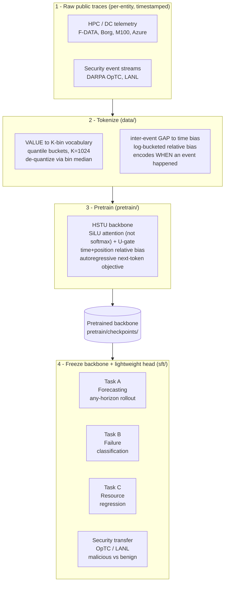

# All-in-One — a Generative Foundation Model for Network & Systems Telemetry

**One backbone, pretrained once on unlabeled system telemetry, that then serves any
forecasting horizon and transfers to classification and regression at near-zero extra
cost.** Instead of training a separate model per task, per entity type, and per prediction
horizon (the "model zoo" every production stack accumulates), we cast all telemetry as
*irregularly-timed entity event streams* and learn a single generative sequential
transducer (HSTU, [arXiv:2402.17152](https://arxiv.org/abs/2402.17152)) over them.

> **Direction (Frame 2 — cross-domain):** pretrain broadly on HPC/DC telemetry, then
> **transfer to a real security task** (red-team / malicious-vs-benign detection on
> national-lab host-and-network event streams). The cross-domain transfer is the paper's
> decisive experiment, not an afterthought.

---

## The idea in one paragraph

Think of it as **autocomplete for machine behavior**. A phone keyboard watches the words
you have typed and predicts the next one; feed the prediction back and it writes a whole
sentence. We do the same with machine *events*: given an entity's history (a user's jobs, a
node's power readings, a host's security events), the model predicts the **next event**, and
by rolling that forward it produces a future of **any length**. Because the future comes from
rollout rather than a fixed output layer, **one model covers every horizon** — no more "one
model for 1-step-ahead, another for 16-steps-ahead." And because pretraining learns a general
representation of telemetry, a **frozen backbone plus a tiny task head** answers new questions
(will this job fail? is this host compromised?) without retraining the core.

---

## Framework at a glance



*Read it top to bottom:* raw traces become tokenized event streams, one HSTU backbone is
pretrained autoregressively on them, the resulting backbone is frozen, and each downstream
task just plugs in a small head.

---

## How the method works, step by step

### 1. Telemetry as entity event streams
Every source produces **entities** (a user, job, VM, node, host, or flow), and each entity
emits a sequence of **timestamped events** `(t_1, x_1), (t_2, x_2), ...`, where `x_i` is a
measurement (job duration, CPU reading, packet size, security event) and `t_i` is the
entity's *own* clock. Events arrive when the workload dictates, **not on a shared grid** —
and much of an event's meaning lives in *when* it happened.

### 2. Two tokenizers (both matter)
- **Value → vocabulary.** Each continuous target is bucketized by **quantiles** into
  `K = 1024` tokens (our own vocabulary); a token is turned back into a value via its bin
  median. This lets a single softmax speak the "language" of heterogeneous telemetry.
- **Inter-event gap → time bias.** The time gap between consecutive events does **not** enter
  the vocabulary. It is log-bucketed and injected into the attention as a **relative bias**,
  so the model can condition on *how long* passed since the last event. This is the signal a
  uniform-grid forecaster throws away.

### 3. The HSTU backbone, in plain terms
It is an attention model like a Transformer, with three changes tuned for high-cardinality,
irregularly-timed streams:
- **Keeps intensity, not just proportion.** Standard softmax attention forces the weights over
  past events to sum to 1, which erases *how much* total activity there is. HSTU replaces it
  with `SiLU(QKᵀ + bias) / N` (a pointwise gate divided by a fixed length), so a burst of
  strongly-relevant history stays loud instead of being normalized away.
- **A learned volume knob (U-gate).** The attention output is passed through a context-dependent
  gate `U ⊙ Norm(A·V)`, turning useful features up and noise down.
- **Reads the clock (time bias).** The relative bias buckets both *position* and the *inter-event
  gap*, so order and timing are both first-class. This is why the model wins on irregular event
  streams and only ties on uniform grids (where the gap carries no information).

### 4. Pretraining
The backbone is trained **autoregressively** to predict the next token. It is
self-supervised: every position's label is simply the next event, so no labels are needed and
the whole trace is training signal.

### 5. Any horizon by rollout
A multi-horizon forecast is produced by **autoregressive rollout** — predict the next step,
feed it back, predict the one after. The point forecast at each step is the **median** of the
predicted distribution (which minimizes absolute error). One model therefore spans every
horizon, while classical specialists need one model per horizon.

### 6. Downstream: freeze + a tiny head
For each downstream task we **freeze the pretrained backbone** and finetune only a small
task-specific head (trainable parameters ≈ 0 relative to the backbone). The same backbone
serves forecasting, failure classification, resource regression, and — the Frame-2 goal —
**security detection transferred from telemetry pretraining**.

---

## Repository structure

```
all-in-one/
├── README.md              # this file
├── methods_design.md      # design notes + correspondence to the HSTU paper
│
├── common/                # shared library (imported by pretrain/ and sft/)
│   ├── nfm_core.py        # HSTU backbone (SiLU attn, U-gate, time+pos bias),
│   │                      #   backbone()/freeze_backbone()/swap_head();
│   │                      #   Quantizer tokenizer; TFM/LSTM/GRU baselines;
│   │                      #   train_gen, median rollout, mase, rank_metrics
│   └── baselines_sota.py  # per-horizon GBM regressor + Chronos-Bolt zero-shot
│
├── data/                  # turn raw traces -> per-entity (value, timestamp) sequences
│   ├── nfm_data.py        # one adapter per dataset (fdata/borg/alibaba/azure/m100/beam)
│   ├── README.md          # download commands + where processed data lands
│   ├── raw/               # (git-ignored) downloaded raw traces
│   └── processed/         # (git-ignored) processed parquet/npy
│
├── pretrain/              # pretrain the backbone + forecasting evaluation
│   ├── pretrain.py        # cross-domain pretraining (shared-vocab scale tokenizer)
│   ├── run_horizon.py     # multi-horizon forecasting runner + all baselines + Chronos
│   ├── bench_single.py    # (legacy) horizon-1 next-token benchmark
│   ├── bench_horizon.py   # (legacy) multi-horizon benchmark
│   └── checkpoints/       # (git-ignored weights) pretrained backbone .pt lands here
│
└── sft/                   # supervised finetuning / transfer (freeze backbone + head)
    ├── demo_pipeline.py   # pretrain -> freeze -> swap head -> finetune head (Tasks A/B/C)
    └── checkpoints/       # (git-ignored weights) finetuned task heads land here
```

**Note on data & checkpoints:** the actual multi-GB traces and trained weights live on the
lab box (`~/nfm/`) and are git-ignored; git tracks only the code, the READMEs, and the empty
`raw/`, `processed/`, and `checkpoints/` folders (via `.gitkeep`). The `common/` and `data/`
paths are wired into each entry script's header, so imports work regardless of where you run
`python` from.

---

## Datasets (Frame 2)

Full download commands and per-dataset notes are in **[`data/README.md`](data/README.md)**.

**Pretraining — HPC / DC telemetry (irregular event + uniform):**

| name | domain | type | entity → target | timestamp |
|---|---|---|---|---|
| **fdata** (Fugaku) | HPC | event | per-user job → duration | job arrival (irregular) |
| **borg** (Google 2011) | DC | event | per-user task → duration | µs event time (irregular) |
| **m100** (Marconi100) | HPC | uniform | per-node → PSU power | 15-min grid |
| **azure** (VM 2017) | DC | uniform | per-VM → avg CPU | 5-min grid |

**Security transfer target — real attack labels (cross-domain):**

| name | year | domain | labels | license | note |
|---|---|---|---|---|---|
| **DARPA OpTC** | 2020 | enterprise host+net, 1000 hosts | red-team malicious/benign | public domain | ~17B events; best fit, irregular event stream |
| **LANL Unified Host+Net** | 2017 | national-lab enterprise | auth / lateral-movement | CC0 | HPC-adjacent, billions of events |
| **AIT-LDS v2.0** | 2022 | enterprise testbed | line-level MITRE ATT&CK | CC-BY-**NC** | most recent, per-event labels |

> **Honest gap:** no public *HPC-compute* intrusion trace (supercomputer syscall/audit logs
> with attack labels) exists. Supercomputer logs (BGL/Thunderbird) are RAS/reliability-labeled,
> not security-labeled. Frame 2 therefore transfers to national-lab / enterprise-scale security
> event streams (OpTC, LANL), which is the closest large, real-attack-labeled setting.

---

## Environment

```bash
curl -LsSf https://astral.sh/uv/install.sh | sh
uv venv --python 3.11 && source .venv/bin/activate
uv pip install torch --index-url https://download.pytorch.org/whl/cu124   # cu124 matches driver <= 12.4
uv pip install numpy pandas pyarrow scikit-learn chronos-forecasting
```
Installing extra time-series libraries can silently upgrade torch and break CUDA — keep
`torch==2.6.0+cu124`. Reference GPU: one RTX 4090 (24 GB), bf16.

---

## How to run

Run from the repo root; the entry scripts resolve `common/` and `data/` themselves.

**1. Multi-horizon forecasting table** (one dataset at a time):
```bash
K=1024 CTX=32 HMAX=16 D=256 H=4 L=4 EP=10 CHRONOS=1 \
  python pretrain/run_horizon.py fdata     # or borg / alibaba / azure / m100
```
Prints per-horizon MASE for persistence, ctx-mean, per-horizon GBM, LSTM, GRU, Transformer,
HSTU, and Chronos, plus HSTU-faithful next-token ranking (HR@K / NDCG@K / MRR).

**2. Cross-domain pretraining** (one HSTU pooled over several domains, evaluated zero-shot):
```bash
K=1024 CTX=64 HMAX=16 D=256 L=4 PRE_EP=10 DOMAINS=fdata,borg,m100 \
  python pretrain/pretrain.py
```

**3. Full FM pipeline demo** (pretrain → freeze → head-swap finetune → Tasks A/B/C):
```bash
D=256 L=4 PRE_EP=10 FT_EP=6 CHRONOS=1 python sft/demo_pipeline.py
```

---

## Key findings (honest)

- **Irregularly-timed event streams** (job/task logs): HSTU is the best forecaster, leading a
  matched Transformer, LSTM/GRU, a per-horizon GBM, and zero-shot Chronos — margin largest at
  long horizons. The edge comes from the time-aware relative bias.
- **Uniformly-sampled telemetry** (fixed grid): HSTU still beats Chronos + GBM but only *ties*
  the deep sequence baselines, because a constant interval makes the time bias uninformative.
- **Transfer:** a frozen backbone + a ~0-parameter head beats a full from-scratch model on
  failure classification (AUC/AUPRC), and *honestly fails* to help on a target uncorrelated
  with pretraining (node-count regression) — transfer is task-dependent.
- **Scale matters more than model size:** a from-scratch single-domain HSTU only overtakes a
  large pretrained Chronos once pretraining data is large; growing the *model* past D=256/L=4
  overfits at this scale.

---

## Method correspondence (HSTU paper, arXiv:2402.17152)

Attention `SiLU(QKᵀ + rab^{p,t}) / N` (not softmax), U-gating, the SiLU pointwise projection,
and the `RelativeBucketedTimeAndPositionBasedBias` (position + log-bucketed time gaps) are
reproduced in `common/nfm_core.py`. Autoregressive next-token training with full softmax over
the 1024-bin vocabulary is the unsampled equivalent of the paper's sampled-softmax retrieval
loss for a small vocabulary. See `methods_design.md` for the line-by-line mapping.

## References
- HSTU / generative recommenders — [arXiv:2402.17152](https://arxiv.org/abs/2402.17152)
- Chronos (time-series foundation model baseline) — [arXiv:2403.07815](https://arxiv.org/abs/2403.07815)
- F-DATA (Fugaku job dataset) — Zenodo `11467483`
