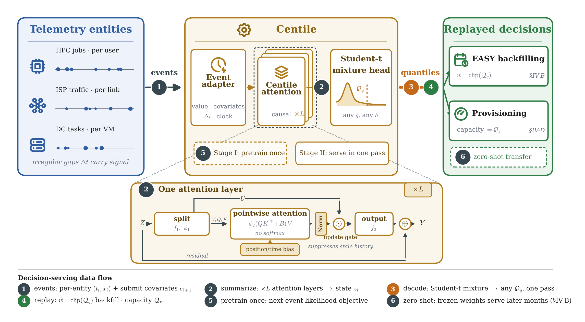
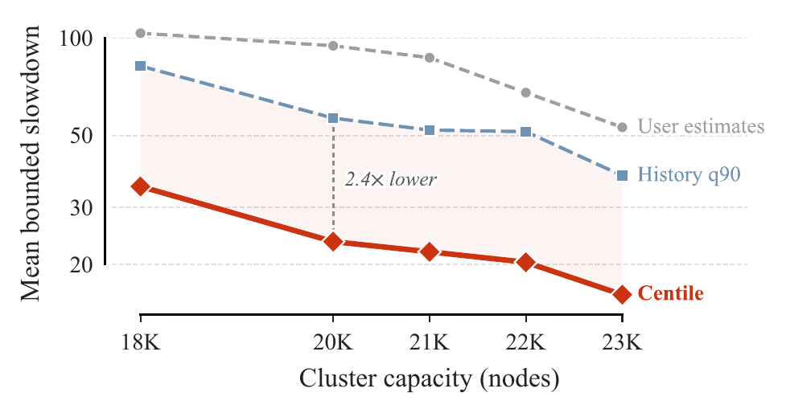
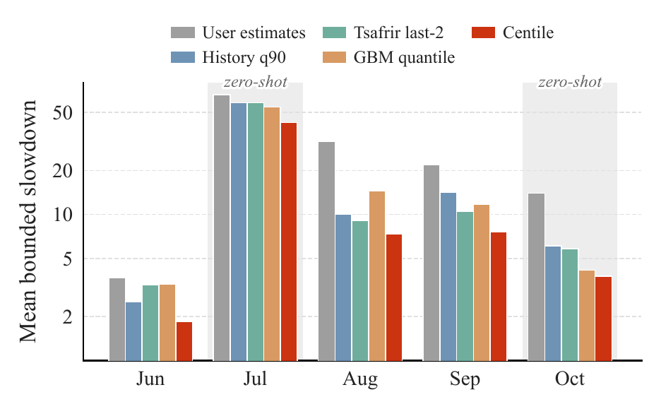
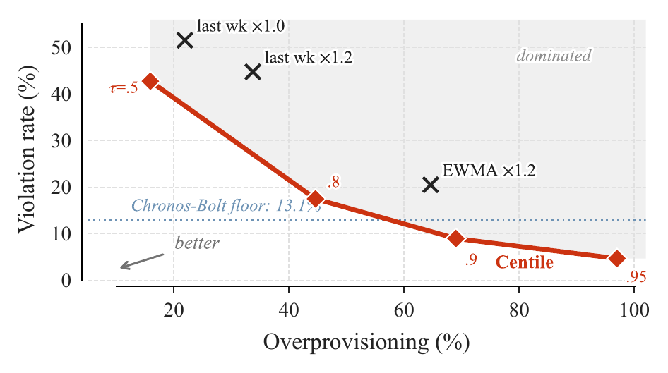
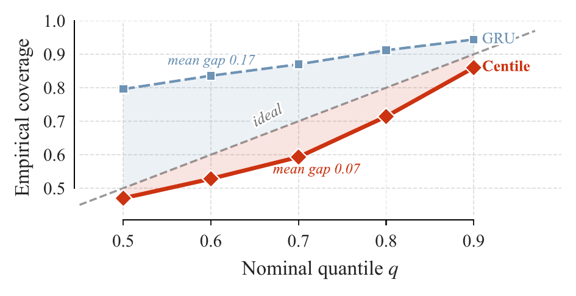
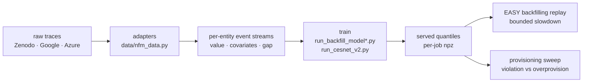

<div align="center">

<h1>Centile</h1>

<p><b>One pretrained model over irregularly timed telemetry, evaluated by replaying the operator decisions it drives.</b></p>

<p>
  <a href="https://www.python.org/"></a>
  <a href="https://pytorch.org/"></a>
  <a href="results-hazel/"></a>
  <a href="LICENSE"></a>
</p>



<p><sub><b>Figure 1.</b> Events from telemetry entities flow through the adapter, the pretrained attention layers, and the mixture head into quantiles that drive the replayed decisions. The inset expands one attention layer.</sub></p>

</div>

Code and experiment artifacts for **_Centile: A Telemetry Foundation Model Evaluated by the Decisions It Drives_**.

Operators do not consume forecasts, they consume decisions. A backfilling scheduler reserves nodes against a walltime estimate, and a capacity planner locks in next-hour bandwidth at a traffic percentile. Both read a *quantile*, not a point forecast. Centile is one generative model, pretrained once per domain on unlabeled telemetry event streams, that serves conditional quantiles for any horizon in a single pass. It is scored by replaying those two recorded decisions, because point-forecast error saturates near last-value baselines while the decisions those forecasts drive diverge.

> [!NOTE]
> This repository holds the model, both replay harnesses, every baseline, and the raw stdout of the cluster jobs behind each number. It does **not** redistribute the traces, which are public and linked under [Data](#data), and it does **not** host pretrained weights: the runtime estimator is 1.3M parameters and retrains from scratch in about five minutes on one GPU.
>
> The repository is named `all-in-one` for historical reasons and keeps that name so published links stay valid. The system is Centile throughout.

## What is here, and what is not

**Here.** Two decision-replay harnesses: an EASY-backfilling scheduler replay over Fugaku job logs, and a next-hour capacity-provisioning sweep over national ISP traffic. The model itself, in `common/nfm_v2.py`. Every baseline the paper compares against: user-declared limits, per-user rolling quantiles, the Tsafrir last-2 predictor, gradient-boosted quantile regression, size-matched GRU and gated-retention models, and zero-shot Chronos-Bolt. The exact Slurm scripts used for the paper, in `hazel-jobs/`, and their stdout in `results-hazel/logs/`.

**Not here.** No downloadable checkpoint, no packaged library, no scheduler you can deploy. The backfilling replay is an offline re-execution of a recorded submission stream: it is our own EASY implementation, in which the walltime estimate is the only quantity that differs between arms and reservations use the standard estimate-extension correction, so scheduling outcomes do not feed back into user behavior. Reproducing the paper means downloading the traces and rerunning the campaign, not loading weights.

## Results

Every number below is measured on the traces named. Bold marks the best estimator. Scheduling with true runtimes is a **reference, not an upper bound**: under EASY, schedule quality is not monotone in estimate accuracy, so exact runtimes can and do lose.

### Decision 1 — EASY backfilling on Fugaku job logs

Mean and 95th-percentile **bounded slowdown** at two backlogged capacities, replaying 48,826 jobs from 298 users over two weeks after a one-week warm-up. The walltime estimate is the only quantity that differs between rows.

| Walltime source | 20K nodes, mean | 20K, P95 | 23K nodes, mean | 23K, P95 |
|:---|---:|---:|---:|---:|
| User estimates (deployed) | 94.8 | 279.9 | 53.1 | 171.4 |
| History q90 | 56.6 | 104.8 | 37.6 | 53.9 |
| Tsafrir last-2 | 24.3 | 31.1 | 23.1 | 21.2 |
| GBM quantile | 25.4 | 34.9 | 19.7 | 32.1 |
| **Centile** | **22.2** ± 2.1 | **28.0** | **15.5** ± 1.1 | **17.8** |
| *True runtimes (reference)* | *17.7* | *69.6* | *28.9* | *169.9* |

Up to roughly **77% below the deployed user estimates**, and the best P95 tail of every walltime source at both capacities. Centile rows are five-seed mean ± std from `pretrain/run_backfill_model.py` at `q=0.5`, replayed by `pretrain/run_backfill_replay.py` (`hazel-jobs/bf_seed.sub`).

<table align="center">
<tr>
  <td width="50%"></td>
  <td width="50%"></td>
</tr>
<tr>
  <td align="center"><sub><b>(a)</b> Across the backlogged capacity band.</sub></td>
  <td align="center"><sub><b>(b)</b> Across months; shaded months are served zero-shot.</sub></td>
</tr>
</table>

The same estimator is the best walltime source on every evaluated month. Two of those months are served **zero-shot**, by weights pretrained on April and never exposed to the target month, with no per-month tuning of any kind.

### Decision 2 — next-hour capacity provisioning on ISP traffic

Provisioning **violation rate (%)** at matched served quantiles on CESNET-TimeSeries24, hourly per-institution volumes split chronologically 80/20 and evaluated on 3,000 held-out windows.

| Served quantile τ | 0.5 | 0.8 | 0.9 | 0.95 |
|:---|---:|---:|---:|---:|
| Chronos-Bolt, zero-shot | 48.7 | 23.0 | 13.1 | — |
| **Centile** | **42.8** | **17.5** | **9.0** | **4.7** |

At an overprovisioning level comparable to the deployed EWMA rule, the violation rate falls from 20.5% to 9.0%. The zero-shot baseline's native quantile grid ends at 0.9, so it cannot be asked for a tighter guarantee at all, while the mixture head serves 0.95 and holds 4.7%.

<table align="center">
<tr>
  <td width="50%"></td>
  <td width="50%"></td>
</tr>
<tr>
  <td align="center"><sub><b>(a)</b> Provisioning frontier; crosses are operator rules.</sub></td>
  <td align="center"><sub><b>(b)</b> Nominal quantile vs. empirical coverage.</sub></td>
</tr>
</table>

Panel (b) is why the operating point can be chosen from risk preference alone: across the nominal grid, the served quantiles track their empirical coverage with a mean gap of **0.07**, against **0.17** for a GRU trained under the identical protocol.

### Cross-domain transfer

Pretrain on ISP traffic and cloud VM CPU telemetry, neither of which contains a single job duration, then adapt to Fugaku walltime estimation under a shrinking target-data budget. Mean bounded slowdown at 20,000 nodes, three-seed mean ± std.

| Target budget | Scratch | Transfer |
|:---|---:|---:|
| 6 hours | 83.0 ± 36.0 | **35.9 ± 1.3** |
| 1 day | 43.7 ± 13.1 | **22.8 ± 2.3** |
| 2 days | 25.8 ± 1.2 | **24.6 ± 2.9** |
| 7 days (full) | 26.0 ± 2.2 | 26.0 ± 1.5 |

One day of target history is enough, and the worst transfer seed (26.1) still beats the best scratch seed (33.9). At six hours the three scratch seeds range from 36.7 to 124.5, so a single from-scratch run at that budget is not predictable in advance, while transfer holds ± 1.3. This grid uses its own three-seed protocol and reads slightly above the five-seed numbers of the first table.

### Deployment profile

| Property | Measured |
|:---|:---|
| Parameters | 1.32 M |
| Artifact size (`bf16`) | 2.5 MiB |
| Training, one A30 GPU | approx. 5 minutes |
| Per-job CPU inference, 4 cores | 4.2 ms batched, 7.7 ms single |
| New month | zero-shot, no retraining |

No GPU on the inference path.

## How it works

Three telemetry-specific choices separate Centile from a general-purpose forecaster.

**Intensity-preserving attention.** Softmax forces the weights over past events to sum to one, which erases *how much* total activity a window carries. Centile aggregates pointwise with SiLU and forgoes softmax normalization, so a burst of strongly relevant history stays loud. Position and the log-bucketed inter-event gap enter as a relative bias, so *when* an event happened is first-class rather than discarded by a uniform sampling grid.

**A heavy-tailed output.** Runtimes and traffic volumes are heavy-tailed, and a squared-error head averages the tail away. A Student-t mixture head puts explicit mass there, which is what lets the model serve a τ = 0.95 the fixed grid of a general-purpose forecaster cannot reach.

**Direct multi-horizon decoding.** Every horizon is served in one pass, conditioned on the horizon rather than produced by autoregressive rollout. Rollout error compounds to 8.34 MASE by 64 steps where direct decoding holds 4.35, and one direct pass serves all 25 input-length and horizon combinations in 5.2 s against 69.4 s for a single rollout combination.

The model is in `common/nfm_v2.py`. `common/nfm_core.py` holds the earlier single-horizon variant and the sequence baselines.

## Installation

Tested on Linux with CUDA 12.4, Python 3.11, one NVIDIA A30 (24 GB).

```bash
git clone https://github.com/ZzZTripleZzZ/all-in-one.git
cd all-in-one

curl -LsSf https://astral.sh/uv/install.sh | sh
uv venv --python 3.11 && source .venv/bin/activate
uv pip install torch==2.6.0 --index-url https://download.pytorch.org/whl/cu124
uv pip install numpy pandas pyarrow scikit-learn
uv pip install chronos-forecasting        # only for the zero-shot baseline
```

> [!IMPORTANT]
> Installing extra time-series libraries can silently upgrade torch and break the CUDA build. Pin `torch==2.6.0+cu124`.

Entry scripts are configured by **environment variables**, resolve `common/` and `data/` themselves, and read traces from `~/nfm/data/<dataset>/`. Run them from the repository root.

## Quick start

About 30 minutes end to end, one month of job logs and one GPU. It reproduces the shape of the headline result on a single seed.

```bash
# 1. one month of Fugaku job logs
mkdir -p ~/nfm/data/fdata && cd ~/nfm/data/fdata
wget -O 21_04.parquet "https://zenodo.org/api/records/11467483/files/21_04.parquet/content"
cd -

# 2. replay the deployed baselines only: no model, no GPU (~1 min)
NODES=20000 python pretrain/run_backfill_replay.py

# 3. train the runtime estimator (~5 min on one A30)
SEED=0 ARM=HSTU LMAX=96 D=256 H=8 L=4 EP=30 MIX=6 STRIDE=24 QS=0.5,0.6 \
  OUT=~/nfm/data/backfill_est python pretrain/run_backfill_model.py

# 4. replay again, now scheduling against Centile quantiles
NODES=20000 HISTQ=0.9 MODEL_EST=~/nfm/data/backfill_est/hstu_q50.npz \
  python pretrain/run_backfill_replay.py
```

Step 2 prints the deployed-estimate and history rows of the first table, step 4 prints the Centile row. Replay itself is deterministic, so the reference arms are byte-identical between the two runs and a single seed lands within roughly one standard deviation of the reported 22.2.

For a faster check that trains on a fraction of the window:

```bash
SMOKE=1 ARM=HSTU QS=0.8,0.9 OUT=~/nfm/data/backfill_est_smoke python pretrain/run_backfill_model.py
NODES=20000 MAXJ=20000 HISTQ=0.9 MODEL_EST=~/nfm/data/backfill_est_smoke/hstu_q90.npz \
  python pretrain/run_backfill_replay.py
```

## Data

Four public traces, none redistributed here. Download commands and per-dataset notes are in [`data/README.md`](data/README.md), and the adapters that turn each raw trace into per-entity `(value, timestamp)` streams are in `data/nfm_data.py`.

| Dataset | Role | Sampling | Source |
|:---|:---|:---|:---|
| **F-DATA** (Fugaku job logs) | Decision 1, backfilling replay | irregular, per job | Zenodo [`11467483`](https://zenodo.org/records/11467483), monthly `YY_MM.parquet` |
| **CESNET-TimeSeries24** | Decision 2, provisioning | hourly grid | Zenodo [`13382427`](https://zenodo.org/records/13382427), `institutions/agg_1_hour/` |
| **Azure VM 2017** | cross-domain pretraining source | 5-min grid | [AzurePublicDataset](https://github.com/Azure/AzurePublicDataset), release `dataset-v1` |
| **M100 / Borg / Alibaba** | pretraining-scale and bake-off runs | mixed | Zenodo `7541722`, Google `clusterdata-2011-2`, Alibaba `v2018Traces` |

F-DATA is not in Standard Workload Format; the replay reads the parquet columns directly (`adt` submit time, `nnumr` nodes, `elpl` user limit, `duration` true runtime). CESNET needs one preprocessing pass into an hourly array:

```bash
python data/prep_cesnet.py     # -> ~/nfm/data/cesnet/cesnet_hourly.npz
```

Evaluation traces are never part of any pretraining corpus. Where a month is labelled zero-shot, the weights were fitted on strictly earlier months and the target month contributes nothing but the per-user histories read at inference.

## Reproducing the paper

Each experiment is one environment-variable line over one entry script. The `hazel-jobs/*.sub` files are the exact Slurm scripts used, including the per-seed, per-month, and per-budget sweeps, and their stdout is preserved in [`results-hazel/logs/`](results-hazel/logs/). Wall-clock figures are for one A30.

| Paper claim | Entry script | Driver job | Cost |
|:---|:---|:---|:---|
| Backfilling table, five seeds | `run_backfill_model.py` + `run_backfill_replay.py` | `bf_seed.sub` | ~10 min/seed |
| Estimator baselines (Tsafrir, GBM) | `run_backfill_baselines.py` | `bf_baselines.sub` | ~10 min, CPU |
| Capacity band figure | `run_backfill_replay.py` | `bf_capsweep.sub`, `bf_bandext.sub` | ~15 min, CPU |
| Per-month table, zero-shot months | `run_backfill_model.py` | `bf_month.sub` (`M=1..5`) | ~20 min/month |
| Pretraining-scale sweep | `run_backfill_model_v2.py` | `bf_scale.sub` (`C=0,1,2,4`) | up to ~2 h |
| Cross-domain transfer grid | `run_transfer_v2.py` | `transfer_launch.sh` | ~6 h, 25 jobs |
| Provisioning frontier, forecast quality | `run_cesnet_v2.py` | `cesnet_full.sub` | ~4 h |
| Zero-shot Chronos-Bolt baseline | `run_cesnet_chronos.py` | `cesnet_chronos.sub` | ~1 h |
| History and covariate ablations | `run_backfill_model_v2.py` (`ABL=nohist\|nocov`) | `bf_abl.sub` | ~10 min/arm |
| GRU control | `run_backfill_model_v2.py` (`ARM=GRU`) | `bf_v2.sub` (`MODE=gru`) | ~10 min/seed |
| Deployment profile | `pretrain/efficiency.py`, `scripts/bench_efficiency.py` | `eff.sub` | ~5 min |

Entry scripts live in `pretrain/`, driver jobs in `hazel-jobs/`.

Two configurations of the same design appear in the paper, and the split is deliberate. The primary backfilling and per-month replays serve the **minimal** estimator (`run_backfill_model.py`: previous runtime plus request covariates, no event-timing inputs), because richer timing inputs did not improve that replay. The transfer and pretraining-scale runs serve the **extended** configuration (`run_backfill_model_v2.py` with `USE_TIME=1`), which adds inter-arrival and clock covariates and the attention time bias. The ablation arms are covariate-matched within themselves and therefore read slightly below the five-seed headline.



## Repository layout

```
all-in-one/
├── common/                       # model and metrics library
│   ├── nfm_v2.py                 # Centile: attention layers, mixture head, horizon head
│   ├── nfm_core.py               # earlier variant, quantizer, TFM/LSTM/GRU baselines
│   ├── baselines_sota.py         # per-horizon GBM, zero-shot Chronos-Bolt
│   └── metrics_v2.py             # MASE, pinball, CRPS-9, coverage
├── data/                         # trace adapters and preprocessing
│   ├── nfm_data.py               # one adapter per dataset
│   ├── prep_cesnet.py            # CESNET hourly array
│   └── README.md                 # download commands, per-dataset notes
├── pretrain/                     # training and decision replay
│   ├── run_backfill_model.py     # minimal runtime estimator (primary tables)
│   ├── run_backfill_model_v2.py  # extended estimator: timing inputs, ablation arms
│   ├── run_backfill_replay.py    # EASY backfilling scheduler replay
│   ├── run_backfill_baselines.py # Tsafrir last-2, GBM quantile
│   ├── run_transfer_v2.py        # cross-domain pretrain / scratch / transfer / stats-only
│   ├── run_cesnet_v2.py          # provisioning sweep and forecast quality
│   ├── run_cesnet_chronos.py     # zero-shot Chronos-Bolt
│   └── efficiency.py             # parameter count, latency, artifact size
├── sft/                          # frozen-model transfer experiments
├── scripts/                      # benchmarks, probes, unit checks
├── hazel-jobs/                   # the exact Slurm scripts used for the paper
└── results-hazel/logs/           # stdout of those jobs
```

`sft/` and parts of `scripts/` hold exploratory work that did not enter the paper, kept because a campaign log is more useful complete than curated.

## Citation

```bibtex
@article{centile2026,
  title  = {Centile: A Telemetry Foundation Model Evaluated by the Decisions It Drives},
  author = {Zhang, Zifan and Hou, Zhichao and Ji, Tingxiang and Liu, Yuchen},
  year   = {2026}
}
```

## License

MIT, see [LICENSE](LICENSE). F-DATA, CESNET-TimeSeries24, the Azure Public Dataset, M100, Borg, and the Alibaba cluster traces are governed by their own licenses at the sources linked above.
